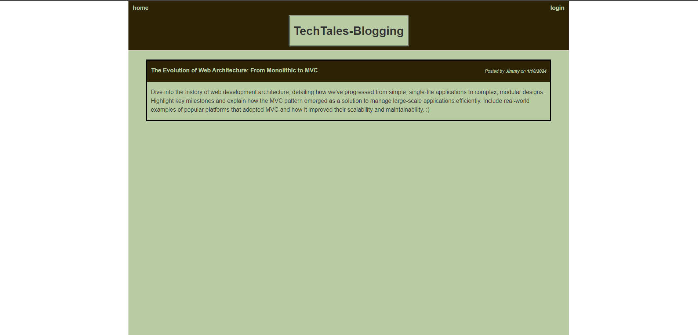

# TechTales-Blogging

TechTales-Blogging is a CMS-style blog site tailored for developers to publish and discuss technical concepts, recent advancements, and new technologies. The platform is built from scratch and adheres to the MVC architectural paradigm, providing an intuitive and engaging user experience.



## Table of Contents

- [Installation](#installation)
- [Usage](#usage)
- [Features](#features)
- [Technology](#technology)
- [Demo Video](#demo-video)
- [Contributing](#contributing)
- [Credits](#credits)

## Installation

To install this application, follow these steps:

1. Clone this repository to your local machine:

```bash
git clone https://github.com/rlobz/TechTales-Blogging.git
```
2. Navigate to the project directory:

```bash
cd TechTales-Blogging
```
3. Install the required npm packages:

```bash
npm install
```
4. Set up your MySQL database and configure the `.env` file with your MySQL username, password, and database name.

5. Start the server using `npm start`.

# Usage

- Homepage: Displays all blog posts.
- Sign Up/Log In: For new users to register and existing users to access their accounts.
- Dashboard: Users can create, view, update, or delete their blog posts.
- Comments: Users can comment on blog posts.

## Features

- **User Authentication**: Secure sign-up and login functionality.
- **Blog Post Creation**: Users can write and publish blog posts.
- **Comment System**: Allows users to comment on posts, fostering community interaction.
- **Dashboard**: A personalized dashboard for managing posts.
- **Responsive Design**: A clean and responsive interface for a seamless experience on various devices.

## Technology

- Node.js and Express.js: For server-side logic.
- Handlebars.js: As the templating language.
- MySQL and Sequelize: For database management.
- bcrypt: For password hashing.
- express-session and connect-session-sequelize: For session management.
- dotenv: To manage environment variables.
- Bootstrap: For styling the frontend.

## Deployment

This application is deployed on Heroku. Check out the live application [here](https://).

## Contributing

Contributions to improve TechTales-Blogging are welcome. Please ensure to update tests as appropriate.

## Credits

**Rafal Lobzowski**
- Github: [@rlobz](https://github.com/rlobz)